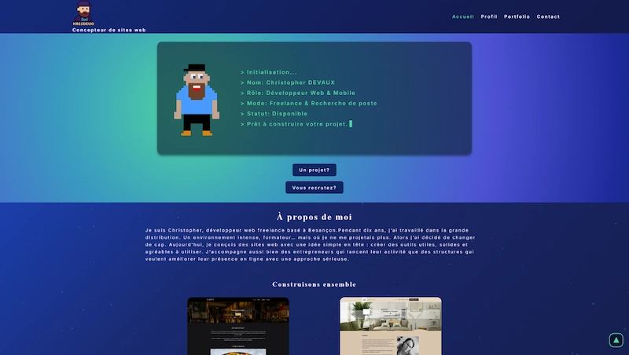

# KrisDevo — Portfolio

Portfolio personnel de Christopher Devaux (KrisDevo), développeur web freelance basé à Besançon.
Site vitrine double audience client/recruteur, conçu et développé de A à Z.

🌐 **[krisdevo.fr](https://krisdevo.fr)**

---

## Présentation

Site portfolio multipage présentant mes services de développement web, mes compétences techniques et mes réalisations. Conçu pour deux audiences distinctes :

- **Clients** — artisans, PME et indépendants de la région de Besançon à la recherche d'un site web
- **Recruteurs** — agences web et entreprises à la recherche d'un développeur web junior

---

## Stack technique

- **HTML5** — structure sémantique multipage
- **SCSS** — architecture en partials, variables, composants
- **JavaScript vanilla** — interactions, animations, formulaire de contact
- **GSAP + ScrollTrigger** — animations au scroll par page
- **tsParticles** — fond animé de particules
- **EmailJS** — formulaire de contact fonctionnel sans backend

---

## Structure du projet

portfolio/
├── index.html              → Page d'accueil
├── profil.html             → Services détaillés + section recruteur
├── portfolio.html          → Réalisations
├── contact.html            → Formulaire de contact
├── images/                 → Assets visuels
├── styles/
│   ├── style.scss          → Point d'entrée SCSS
│   └── partials/
│       ├── variables/
│       │   ├── _colors.scss
│       │   └── _font.scss
│       ├── components/
│       │   ├── _header.scss
│       │   └── _burger.scss
│       └── pages/
│           ├── _base.scss
│           ├── _home.scss
│           ├── _profil.scss
│           ├── _portfolio.scss
│           └── _contact.scss
└── js/
├── main.js             → Particules + menu burger
├── animation.js        → Animations page accueil
├── animation_profil.js → Animations page profil
├── animation_portfolio.js → Animations page portfolio
├── animation_contact.js → Animations page contact
├── portfolio.js        → Onglets + carousel cards portfolio
└── contact.js          → Formulaire EmailJS + protections spam


---

## Fonctionnalités

- Design dark gaming avec identité pixel art
- Animations au scroll avec GSAP ScrollTrigger
- Effet typewriter sur le terminal hero
- Carousel avant/après pour la refonte WordPress
- Système d'onglets sur les cards portfolio
- Formulaire de contact avec protection honeypot et cooldown anti-spam
- Menu burger CSS pur
- Responsive mobile / tablette / desktop
- Déploiement automatique via GitHub Actions

---

## Déploiement

Le site est déployé sur un VPS OVH via un pipeline CI/CD GitHub Actions.

Chaque push sur la branche `master` déclenche automatiquement un déploiement via `rsync` vers le serveur.

**Stack serveur**
- Ubuntu 25.04
- Nginx
- Let's Encrypt (SSL)
- UFW + Fail2ban

---

## Installation locale

Aucune dépendance à installer — projet HTML/CSS/JS vanilla.

1. Clone le repo
```bash
git clone https://github.com/Krisdevo/portfolio.git
cd portfolio
```

2. Ouvre `index.html` dans ton navigateur ou utilise une extension Live Server dans VS Code

3. Pour compiler le SCSS, utilise l'extension **Live Sass Compiler** dans VS Code

> ⚠️ Le formulaire de contact nécessite un fichier `config.js` avec tes clés EmailJS — ce fichier n'est pas versionné pour des raisons de sécurité.

---

## Auteur

**Christopher Devaux** — [krisdevo.fr](https://krisdevo.fr)

[](https://www.linkedin.com/in/christopher-devaux/)
[](https://github.com/Krisdevo)

---

## Licence

Ce projet est sous licence MIT — tu peux t'en inspirer librement mais merci de ne pas le copier tel quel.